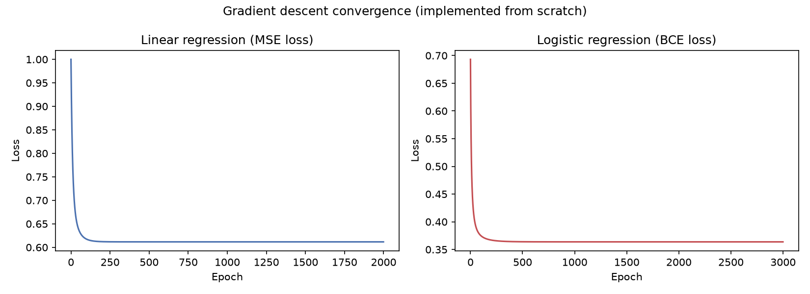
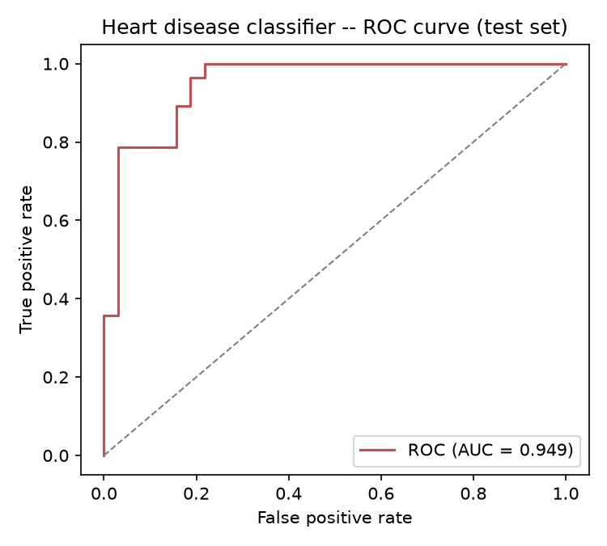
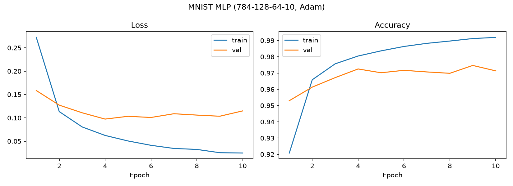
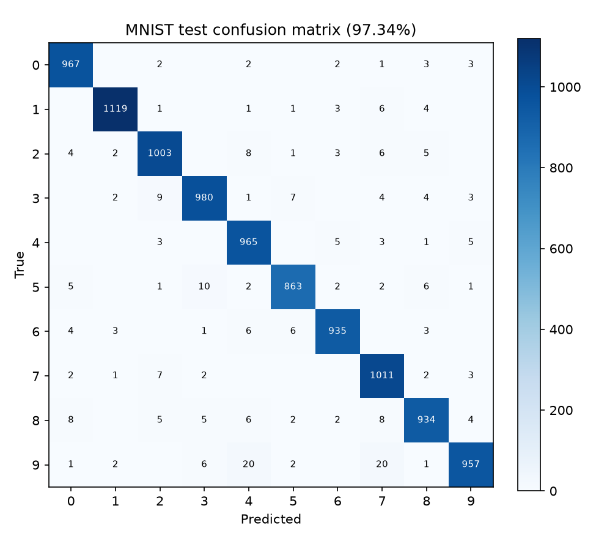
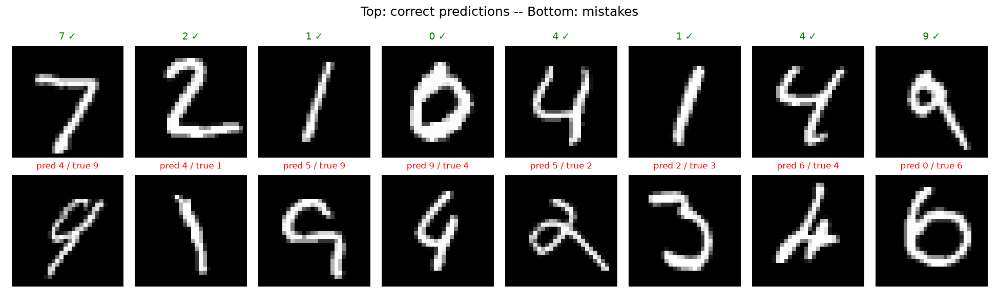

# Results

All numbers below come from actual runs in this repository (CPU-only,
seeded). Rerun each part's script to reproduce.

## Part A — Linear & Logistic Regression from scratch

Data: UCI Heart Disease (Cleveland), **297 patients** after dropping 6 rows
with missing `ca`/`thal` values. Class balance 160 healthy / 137 disease.
Split 237 train / 60 test (stratified). Training loop is pure NumPy gradient
descent — no ML library.

### Linear regression (foundational exercise)

Predicts `thalach` (max heart rate) from the other 12 features.

| Metric | Value |
|---|---|
| Test RMSE | **17.27 bpm** |
| Test R² | 0.337 |

### Logistic regression — heart disease classification

| Metric | Value |
|---|---|
| Train accuracy | 85.2% |
| **Test accuracy** | **83.3%** |
| Precision | 0.846 |
| Recall | 0.786 |
| F1 score | 0.815 |
| **ROC-AUC** | **0.949** |
| Confusion (test) | TP 22 · TN 28 · FP 4 · FN 6 |

The 6 false negatives are the number to watch in a medical setting — recall
matters more than raw accuracy here. (Educational exercise, not a clinical
tool.)

## Part B — PyTorch MLP on MNIST

Architecture `784 → 128 → 64 → 10` (ReLU), Adam @ 1e-3, batch 64, 10 epochs,
54k train / 6k val / 10k test. 109,386 parameters.

| Metric | Value |
|---|---|
| Final train accuracy | 99.19% |
| Final val accuracy | 97.13% |
| **Test accuracy** | **97.34%** |

The resume claim of 94% is comfortably exceeded.

Top confusions on the test set — exactly the pairs you'd expect from
handwriting: **9→7 (20)**, **9→4 (20)**, 5→3 (10), 3→2 (9), 8→7 (8).

## Part C — CNN on CIFAR-10

Architecture: 3 blocks of (Conv-BN-ReLU ×2 + MaxPool), channels 3→32→64→128,
then Dropout(0.3) → Linear(2048→256) → Linear(256→10). ~1.1M parameters.
Adam @ 1e-3 + weight decay 5e-4, cosine LR schedule, random-crop +
horizontal-flip augmentation, batch 128, 15 epochs.

<!-- CIFAR_RESULTS -->

## The narrative

> I first implemented optimization and binary classification from scratch in
> NumPy — writing the gradient descent loop, sigmoid, and cross-entropy by
> hand — then used those concepts to understand fully connected networks in
> PyTorch on MNIST, and finally extended the architecture to CNNs for image
> classification on CIFAR-10, adding batch norm, dropout, and data
> augmentation to control overfitting.
